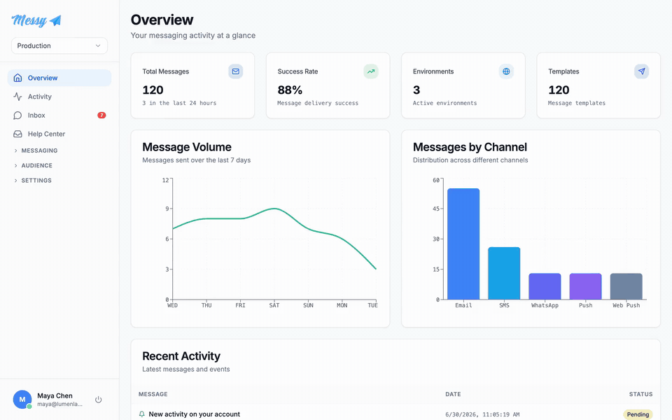

<div align="center">
  <a href="https://messy.sh">
    <picture>
      <source media="(prefers-color-scheme: dark)" srcset=".github/logo-white.png">
      
    </picture>
  </a>

  <p><strong>The open-source messaging platform.</strong><br>
  Email, SMS, WhatsApp and push through one API, with campaigns, drip automation,
  a shared inbox, a chat widget and social publishing.</p>

  <p>
    <a href="LICENSE"></a>
    
    
    
    <a href="CONTRIBUTING.md"></a>
    
  </p>

  <p>
    <a href="https://messy.sh">Website</a> ·
    <a href="https://messy.sh/docs">Docs</a> ·
    <a href="https://messy.sh/docs/docker-compose">Self-host</a> ·
    <a href="https://app.messy.sh">Cloud</a>
  </p>

  
</div>

## What it does

**Sending**

- One `POST /messages` for email, SMS, WhatsApp and push. Or trigger a template by name with your data.
- Templates in Liquid with shared layouts, editable in the app or [synced from your repo](https://messy.sh/docs/sync-templates).
- Campaigns to segments, drip automation with a visual designer, and per-recipient delivery rules that keep test traffic away from real customers.
- Open and click tracking on your own domain.

**Talking**

- A shared inbox for every reply: assignment, tags, snoozing, canned responses and CSAT ratings.
- An embeddable chat widget with real-time messaging and offline capture.
- Two-way email through your own mailboxes.

**Around it**

- Environments with separate API keys, integrations and rules, so staging can't email production customers.
- Bring your own provider keys: AWS SES, any SMTP server, Twilio for SMS and WhatsApp, mobile and web push.
- Social publishing: provision and schedule posts across regions from the same platform.
- An [MCP server](https://messy.sh/docs/mcp) so AI agents can drive all of it.

## Self-host

The whole stack is Rails + Postgres + a React SPA. No Redis: background jobs (Solid Queue) and websockets (Solid Cable) run on Postgres.

```sh
git clone https://github.com/erip-me/messy.git
cd messy
cp .env.example .env
echo "SECRET_KEY_BASE=$(openssl rand -hex 64)" >> .env
docker compose up -d --build
```

Then open http://localhost:8080 and sign up. Full guide (including outbound email setup, which magic-link login needs): [Docker Compose deployment](https://messy.sh/docs/docker-compose). Running Kubernetes? Use the [Terraform deployment](https://messy.sh/docs/terraform) from `deploy/`.

Prefer not to run it yourself? [Messy Cloud](https://messy.sh/pricing) has a BYOK plan (we host, your provider keys) and a managed plan.

## Repository layout

| Directory | What it is |
|---|---|
| `backend/` | Rails 8 API: messages, campaigns, inbox, widget API, MCP server |
| `frontend/` | React + Vite app (the dashboard) |
| `backend/app/javascript/widget/` | Embeddable chat widget (built to `public/widget/messy-widget.js`) |
| `deploy/` | Terraform modules for Kubernetes |

## Development

```sh
# Backend (needs Postgres running locally)
cd backend && bundle install && bin/rails db:prepare && bin/rails server

# Frontend
cd frontend && npm install && npm run dev
```

Backend tests run with `bin/rails test`; the repo's pre-push hook runs the suite for you (`git config core.hooksPath .githooks` after cloning).

## Contributing

PRs are welcome across the repo. Read [CONTRIBUTING.md](CONTRIBUTING.md) for ground rules; commits need a DCO sign-off (`git commit -s`). For anything bigger than a small fix, open an issue first.

Found a security issue? Mail [security@messy.sh](mailto:security@messy.sh) instead of opening an issue. See [SECURITY.md](SECURITY.md).

## License

[Elastic License 2.0](LICENSE): use it, modify it, self-host it commercially. The one thing you can't do is offer Messy itself to third parties as a hosted service. The "Messy" name and logo are trademarks; see [TRADEMARK.md](TRADEMARK.md).

---

Messy is a product of The Empire Holding B.V., Rotterdam, the Netherlands.
